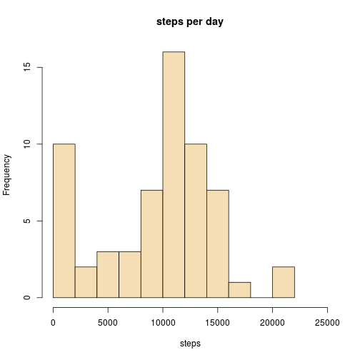
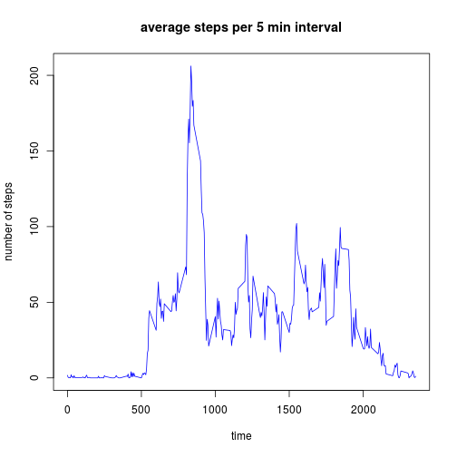
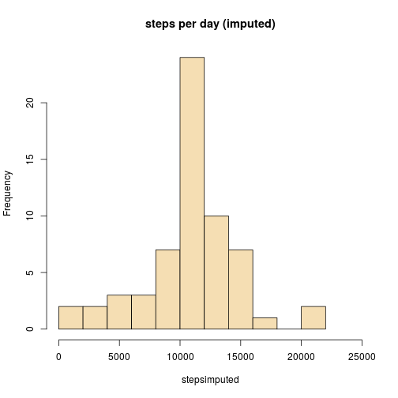
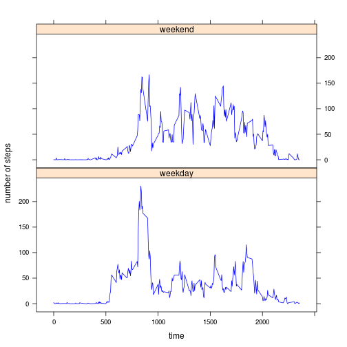

This assignment makes use of data from a personal activity monitoring device. This device collects data at 5 minute intervals throughout the day. The data consists of two months of data from an anonymous individual collected during the months of October and November, 2012 and include the number of steps taken in 5 minute intervals each day.


We upload the `knitr` library and set global option `echo= TRUE` to visualize all code.

```r
library(knitr)
opts_chunk$set(echo=TRUE)
```


## Loading and preprocessing the data


Unzip and load data.

```r
unzip("activity.zip")
data <- read.csv("activity.csv")
str(data)
```

```
## 'data.frame':	17568 obs. of  3 variables:
##  $ steps   : int  NA NA NA NA NA NA NA NA NA NA ...
##  $ date    : Factor w/ 61 levels "2012-10-01","2012-10-02",..: 1 1 1 1 1 1 1 1 1 1 ...
##  $ interval: int  0 5 10 15 20 25 30 35 40 45 ...
```


The variable `date` is not recognized as a date. Needs to be converted.

```r
data$date <- as.Date(data$date, format= "%Y-%m-%d")
str(data)
```

```
## 'data.frame':	17568 obs. of  3 variables:
##  $ steps   : int  NA NA NA NA NA NA NA NA NA NA ...
##  $ date    : Date, format: "2012-10-01" "2012-10-01" ...
##  $ interval: int  0 5 10 15 20 25 30 35 40 45 ...
```


## What is mean total number of steps taken per day?


Sum of the steps taken per day (removing missing data) with `tapply` and build a histogram.

```r
steps <- tapply(data$steps, data$date, FUN= sum, na.rm= TRUE)
hist(steps, breaks= 10, xlim=c(0,25000), col= "wheat", main= "steps per day")
```

 


Calculation of the mean number of steps per day.

```r
meansteps <- mean(steps)
```
The mean total number of steps taken per day, ignoring missing values, is: **9354.23**


## What is the average daily activity pattern?


Average of the number of steps for the 5-minute intervals and building a time series (removing missing values) using `tapply`. The 5-minute intervals are used as index for this function and become the names for the resulting vector. For the x axis on the plot, we transform the names into a character string so that no space is left between 55 (= 55 min) and 100 (= 1h), for example.

```r
steps5min <- tapply(data$steps, data$interval, FUN=mean, na.rm= TRUE)
plot(as.character(names(steps5min)), steps5min, type= "l", col= "blue",
     xlab= "time", ylab= "number of steps", main= "average steps per 5 min interval")
```

 

Calculating the interval with the maximum average number of steps.

```r
maxsteps <- max(steps5min)
intervalmaxsteps <- names(steps5min[steps5min==maxsteps])
```
Interval with the maximum number of steps starts at **835**


## Imputing missing values

Count the number of missing values in the dataset

```r
missing <- is.na(data$steps)
totalmissing <- sum(missing)
```
Number of missing values: **2304**


Imputing missing values:

a- make a copy of the original dataset to include imputed values

b- missing values are replaced by the mean value estimated for that interval from the entire dataset in the previous section.

```r
imputed <- data                           # new data file
for (i in 1:nrow(imputed)){               # reads data set one row at a time
        if (is.na(imputed$steps[i])){
                imputed$steps[i] <- steps5min[names(steps5min)==imputed$interval[i]]
                }
}
```

Sum of the steps taken per day in the imputed data file with `tapply`, calculate mean and median, and and build a histogram.

```r
stepsimputed <- tapply(imputed$steps, imputed$date, FUN= sum)
imputedmean <- mean(stepsimputed)
imputedmedian <- median(stepsimputed)
hist(stepsimputed, breaks= 10, xlim=c(0,25000), col= "wheat", main= "steps per day (imputed)")
```

 

The mean number of steps taken per day, after imputing, is: **10766.19**

The median is: **10766.19**

Mean and mediar are identical. This is because the dates with missing data have NAs for all the time intervals. After imputing, these days will add up to have exactly the mean number of steps for the entire dataset. This can be easily seen by taking a look to the imputed total steps per day in `stepsimputed`: the only totals that have decimals have exactly this mean number of steps.

The mean is larger when missing data are excluded than when data are imputed. This is because when NAs are excluded the day remains in the data file but the total steps add up to 0 (not a single valid data point on those days, so that the addition of values are identical). When using the imputed data, these values are replaced for the average at that time interval, resulting in a larger dayly sum of steps.


## Are there differences in activity patterns between weekdays and weekends?

Two new variables are added to the imputed data file. The first one indicates the day of the week. The second one indicates if this corresponds to weekend or weekday. The last variable is then converted into a factor.

```r
imputed$wday <- weekdays(imputed$date)
for (i in 1:nrow(imputed)){
        if(imputed$wday[i]=="Saturday" | imputed$wday[i]=="Sunday"){
                imputed$wday2[i] <- "weekend"
        } else{
                imputed$wday2[i] <- "weekday"
        }
}
imputed$wday2 <- as.factor(imputed$wday2)
```


Calculation of the mean number of steps at each interval throughout the day separating weeddays and weekend. Time series plots (using package `lattice`) comparing average number steps at 5 minute intervals throughout the day for weekdays and for weekend.

```r
aggdata <- aggregate(steps ~ interval+wday2, mean, data=imputed)
library(lattice)
xyplot(steps ~ interval | wday2, data = aggdata, 
       xlab= "time", ylab= "number of steps", type="l", col= "blue", layout = c(1,2))
```

 

